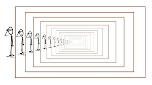

## Recursion examples in java

In this directory you will find examples of the use of recursion using the Java language. Examples include:

* **File Browser**: this algorithm navigates through all files and subfolders of a folder used as a starting point\.